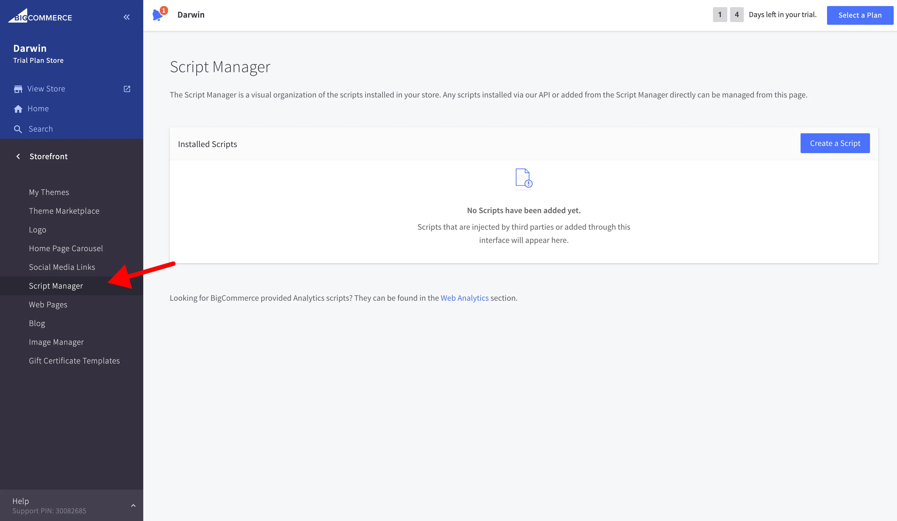
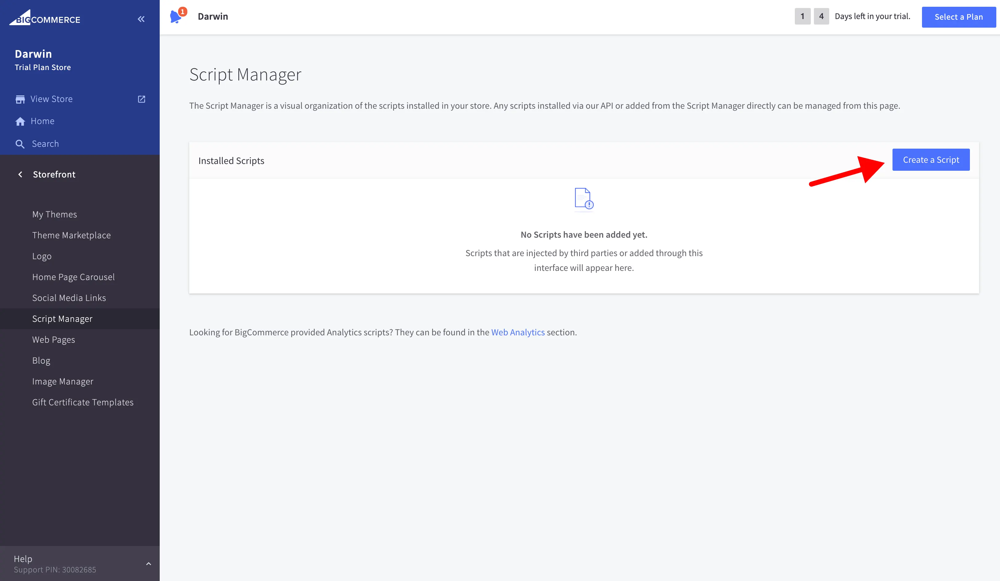

## Before You Start

To add the Kaption tracking code to your [BigCommerce](https://www.bigcommerce.com/) website, you need to use https. If you don't have SSL, the Kaption tracking code won't work right. Here is their guide on [installing an SSL certificate on BigCommerce](https://support.bigcommerce.com/s/article/BigCommerce-SSL-Certificate#install).

### Get Tracking Code

Login to [Kaption's Dashboard](https://app.kaption.co/login) and visit "Tracking Code" in the navigation.

Copy the tracking code HTML that you'll find there.

### Visit BigCommerce Dashboard

[Login to BigCommerce](https://login.bigcommerce.com/) and go to "Storefront".

### Add Custom Code

Go to "Script Manager" page.

Click "Create a Script" button.

Once there, run through the following:

- Type in "Kaption Analytics" into Name of Script
- Description can be anything or left blank.
- Select "Location on Page: Head"
- Choose "Select pages where script will be added: All Pages" method
- Select "Script Category: Analytics"
- Paste your tracking code inside the "Script Contents" textarea.
- Save Changes

### Verify Installation.

Once you've saved your changes, you can verify your install on the [Kaption dashboard](https://app.kaption.co).

