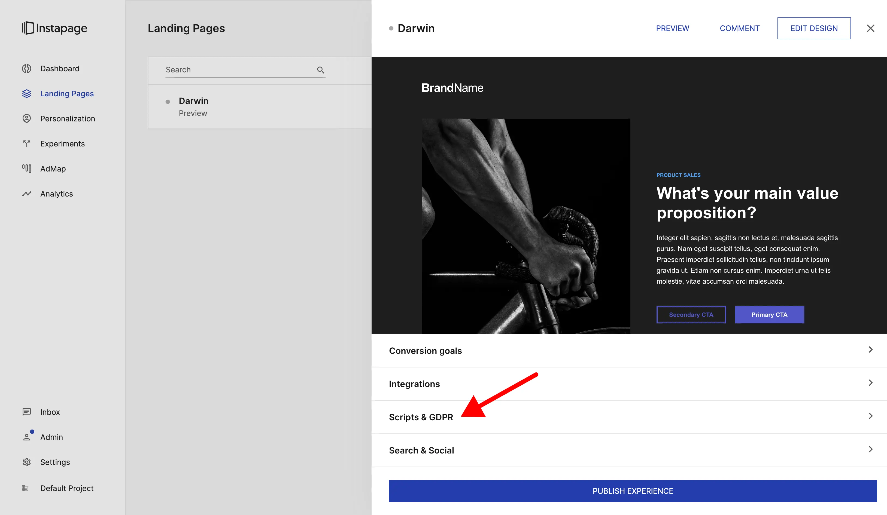
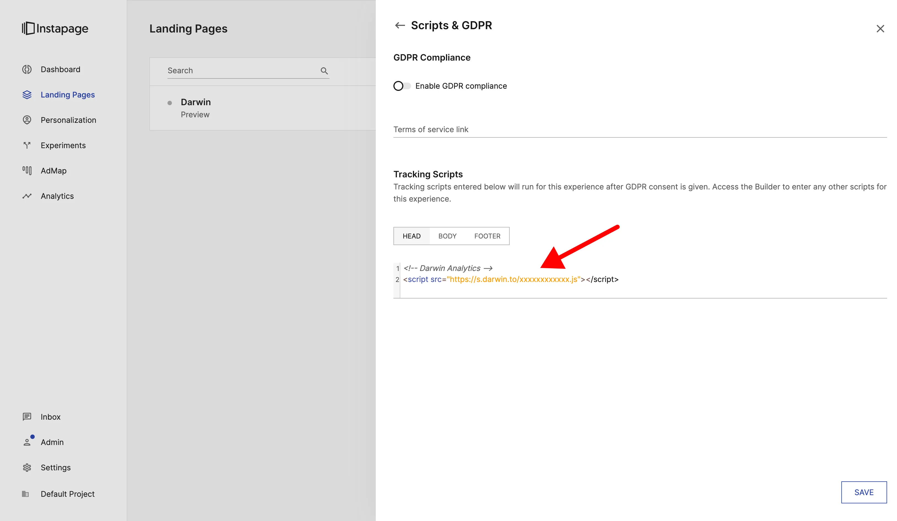

# Install on Instapage

### Before You Start

If you want to track more than one landing page on [Instapage](https://instapage.com/), install a separate tracking code for each.

### Get Tracking Code

Login to [Kaption's Dashboard](https://app.kaption.co/login) and visit "Tracking Code" in the navigation.

Copy the tracking code HTML that you'll find there.

### Visit Instapage Dashboard

[Login to the Instapage dashboard](https://app.instapage.com/) and open your landing page.

### Add Tracking Code

Click on "Scripts & GDPR".

Add the tracking code in the "Tracking Scripts" text box with the "Head" option selected and save.

Go back and click on "Publish Experience" to update your landing page.

### Verify Installation.

Once you've saved your changes, you can verify your install on the [Kaption dashboard](https://app.kaption.co).

