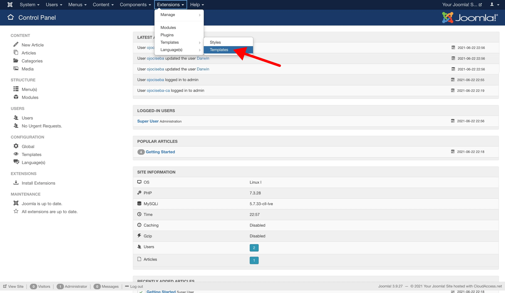
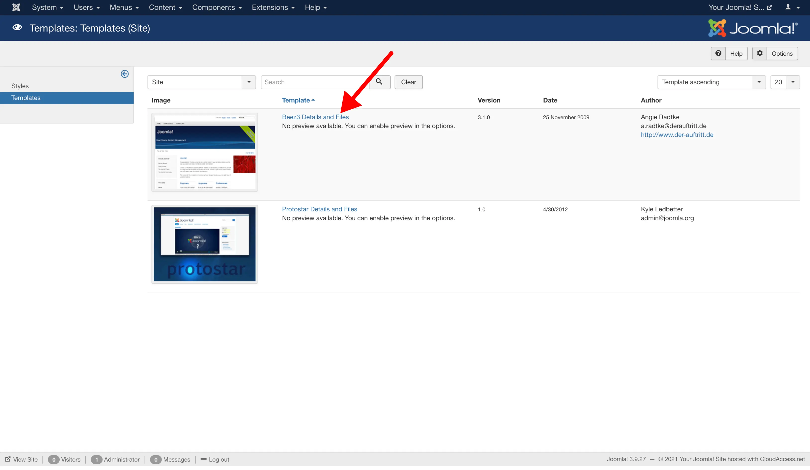
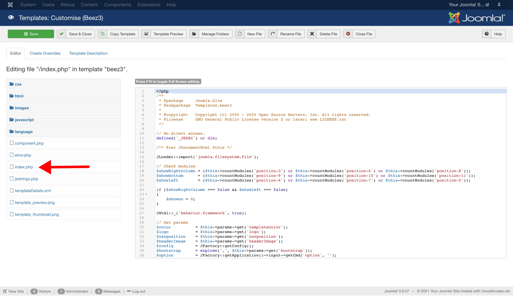
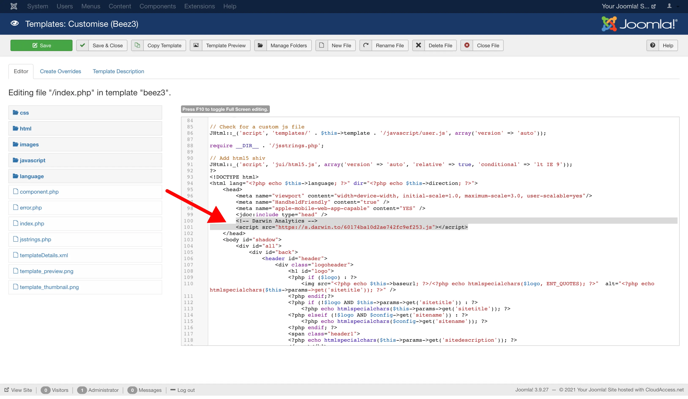

# Install on Joomla

### Before You Start

This guide was written for [Joomla](https://www.joomla.org/) 3.9.27 Stable, using the Protostar theme. If you notice anything different from this guide when you are in your Joomla admin panel, let us know on the [support page](/support).

### Get Tracking Code

Login to [Kaption's Dashboard](https://app.kaption.co/login) and visit "Tracking Code" in the navigation.

Copy the tracking code HTML that you'll find there.

### Visit Joomla Admin Panel

Login to the Joomla admin panel and go to "Extensions > Templates > Templates".

### Add Tracking Code

Click on the title of the template your site is using.

Locate and open the file that contains the `<head>` tag, usually the `index.php` file.

The `<head>` tag might be in a different file other than `index.php` in your theme. If in doubt, consult the documentation of your theme, or contact the theme creator.

Add the tracking code in this file before `</head>` closing tag and save changes.

### Verify Installation.

Once you've saved your changes, you can verify your install on the [Kaption dashboard](https://app.kaption.co).

