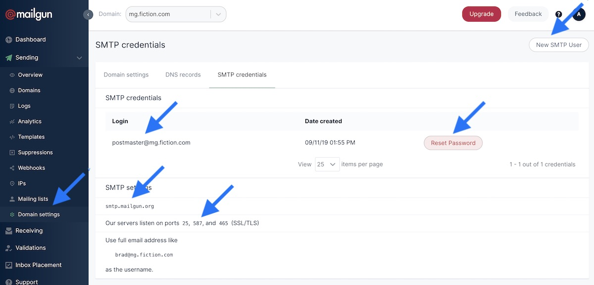

# SMTP Email with Mailgun

Mailgun is a great, cost-effective service for handling transactional SMTP email in Factor. Here are instructions on how to add it.

## Create Mailgun Account

Visit [Mailgun.com](https://www.mailgun.com) and [create an account](https://signup.mailgun.com/new/signup) if you don't have one already.

## Add Your Domain

You'll first need to add a domain for your email handling. To add one, go to **Sending** > **Domains** > **Add New Domain**.


After that, we recommend using a subdomain of your primary app (e.g. `mg.fiction.com`). Once you've created it, you'll need to add some records with your DNS provider. Mailgun walks your through the steps you'll need to follow.

## Get SMTP Credentials

Now that you've got your domain setup, it's simple to get the SMTP credentials you'll need.

Go to **Sending** > **Domain Settings** > **SMTP Credentials**.

Now create a new SMTP user at which point you'll be given your password for connecting.

The information you'll need is the host (smtp.mailgun.org), username and password. Plus optionally which port to use (mailgun supports 25, 587, and 465).



## Add to `.env`

Once you've figured out who you want to handle your email, then all you'll need is a `SMTP_USERNAME`, `SMTP_PASSWORD`, `SMTP_HOST` and optionally an `SMTP_PORT`. Then just add them to your `.env`...

```bash
# .env - SMTP connection info
SMTP_USERNAME="postmaster@your-domain.com"
SMTP_PASSWORD="---YOUR PASSWORD---"
SMTP_HOST="smtp.mailgun.org"
SMTP_PORT=587
```
