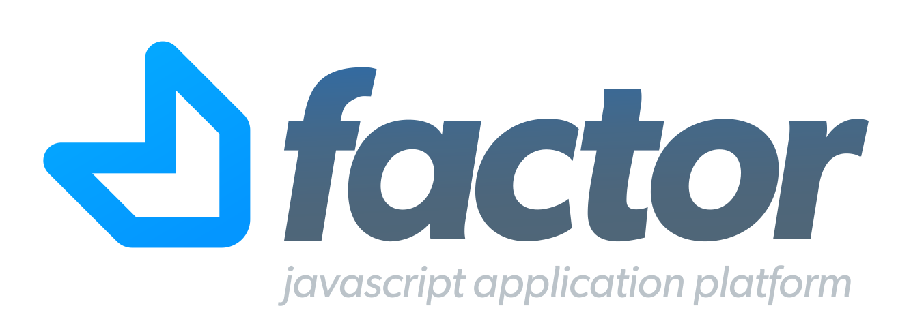

# Introduction

## Overview

**Factor** is a platform that makes it easy to build impressive Javascript apps.

It is based on the VENM Stack ([VueJs](https://vuejs.org), [Express](https://expressjs.com), [NodeJS](https://nodejs.org/en/), [MongoDB](https://github.com/mongodb/mongo)) and its purpose is to worry about best practices so you don't have to...

Unlike most Javascript frameworks, Factor has its primary focus on extension via plugins and themes. It also includes a CMS-oriented dashboard and data model (which are leveraged by extensions).

Factor's end goal is to help you build complete web apps without spending time reinventing the wheel.

## Goals and Non-Goals

The goal of Factor is to help front-end developers ship web apps they can be proud of.

If you work with Javascript and spend lots of time doing rewrites, dealing with bugs and worrying about vendor lock-in then Factor is likely built for you.

**Goals:**

- Focus on the needs of front-end developers
- "One-click" plugin installation and configuration (`yarn add ...`)
- Robust theme system
- Reduce the need to "reinvent the wheel"
- Minimize vendor lock-in
- Create a simple and elegant development experience
- Follow modular and minimal design patterns

**Non-Goals**

- No drag-and-drop builder bloat (_can be added via extension_)
- No needless abstraction (_minimal 3rd party code_)
- No UI framework bloat e.g. Material, Bootstrap (_can be added via themes_)
- No bloat in general (yes, we hate bloat)

## Core Idea

Factor is a combination of the following:

- An extension system for plugins and themes
- A "Universal" Javascript framework (Vue SSR, Node)
- A CMS oriented dashboard and data model

## Next Steps

We'll dive into the details of the dashboard, data model, plugins, themes and framework in a bit.

If you haven't installed Factor yet, let's move on to the [Factor Quickstart &rarr;](./quickstart)
