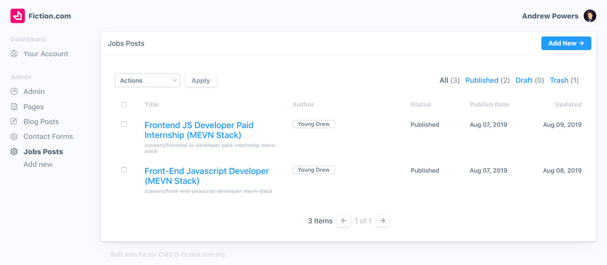

# The Post System

Factor is powered by a post system designed to help simplify and standardize the way your app works with your DB.

## Overview

The post system works by combining all your apps data items, e.g. users, pages, posts, etc.. into a single collection in your DB. Each data type is built on a standard "post type" (called `post`) and then extended.

There are some clear advantages to this approach:

1. **Shared functionality.** Most DB items need common functionality like category filtering or permalinks. With a post system all post-types inherit these tools automatically.
1. **Simplicity.** Since all data types are stored in the same place, it makes it much easier to manage your data. For example, to export/import your entire DB, you're just dealing with a single collection.

## Dashboard and Posts

The Factor dashboard is designed as an interface to your post system. Each type of post will add its own tab, but management is typically the same across many types. For example, you'll need to list and edit blog posts in a similar way to how you manage pages, or job listings, or users, etc..

Below we'll discuss the basics of adding your own "post types" and configuring your dashboard to edit and manage them.



## Working With Posts

### Creating a Post Type

It's easy to add a new post type to Factor, all you need to do is add a new object via the `post-types` filter.

```js
// index.js
import { pushToFilter } from "@factor/tools"
pushToFilter("post-types", {
  postType: "jobs",
  nameIndex: "Jobs",
  nameSingle: "Jobs Post",
  namePlural: "Jobs Posts",
  icon: require("./img/jobs.svg"), // dashboard icon
  baseRoute: "career", // base permalink route
  accessLevel: 100, // user access level needed to edit/add
  add: true, // can new posts be added via dashboard
  showAdmin: true // Set to false to hide list/edit menu in admin
})
```

Adding a new post type will add a new tab in the dashboard. With the default **list** and **edit** views.

Now that you have your post type, it is possible to easily override the dashboard editing templates if you need custom functionality.

To do so, all you need to do is add your own components:

```js
// index.js
pushToFilter("post-types", {
  postType: "my-post-type",
  listTemplate: () => import("./custom-dashboard-list-view.vue"),
  editTemplate: () => import("./custom-post-edit-view.vue")
  // ... other post type options
})
```

Now that we've set up the post type, let's add a validation schema and learn how to work with it on the front end.

## DB Schemas

With NoSQL databases there is no hard coded table structure. This is an advantage, but there are some benefits to validating data format on a post-type level. To do this, we'll use schemas.

> **Mongoose** <br>For data modeling, Factor schemas use the [Mongoose library for MongoDB](https://mongoosejs.com). Make sure to check out its concepts and docs.

### The Base "Post" Schema

Initially, all post types inherit the basic post schema that you can [reference here](https://github.com/fiction-com/factor/blob/master/%40factor/%40core/post/schema.js). This sets up all functionality that is typical between different post types, for example date tracking, tags/categories, permalinks, etc..

For many cases, the base schema is enough. However it is easy to add additional schemas or to extend existings ones...

### Adding a New Post Type Schema

If you'd like to extend the basic post schema, then you'll need to add it using a Factor schema object + filter. As follows:

```js
import { objectIdType } from "@factor/post/util"
// index.js To register a new data schema
pushToFilter("data-schemas", {
   // Post Type Name: url friendly
  name: "post-type-name",
  // Mongoose Middleware/hooks https://mongoosejs.com/docs/middleware.html
  callback: schema => {
    // Mongoose hooks belong here. Actions that take place on save, update, etc.
    schema.pre("save", async function(next) {
      const myPost = this
      // modify document 'this' before it is saved (mongoose 'hook')
      next()
    })
  },
  // Mongoose Schema: https://mongoosejs.com/docs/guide.html
  schema: {
    example: { type: String, trim: true },
    company: [{ type: objectIdType(), ref: "business-profile" }],
  }
  // Schema options: https://mongoosejs.com/docs/guide.html#options
  options: {},
  populatedFields: [
    // List the schema reference fields that should be populated in addition to the post
    // For example, if your post connects with a "company" post type, it would retrieve those posts as well
    // the depth value helps Factor determine when to populate: 0 for no population, 100 for all. Default 20
    { field: "company", depth: 10 }
  ],
})
```

> **Note**<br> Currently, schema changes require a full server restart. That is because Mongo/Mongoose can't reload them dynamically.

### Extending an Existing Schema

If you'd like to extend an existing schema, it's easy through the `data-schema-[POST TYPE]` filter. Just hook in and add your fields:

```js
addFilter('data-schema-page', schemaConfig => {

  // Add to schema
  schemaConfig.schema = {...schemaConfig.schema, {
    comments: [],
  }}

  // Add callback hooks (don't forget to call the original)
  const originalCallback = schemaConfig.callback
  schemaConfig.callback = _schema => {
    originalCallback(_schema)
    schema.pre("save", async function(next) {
      const myPost = this
      // modify document 'this' before it is saved (mongoose 'hook')
      next()
    })

  }

  return schemaConfig
})
```
