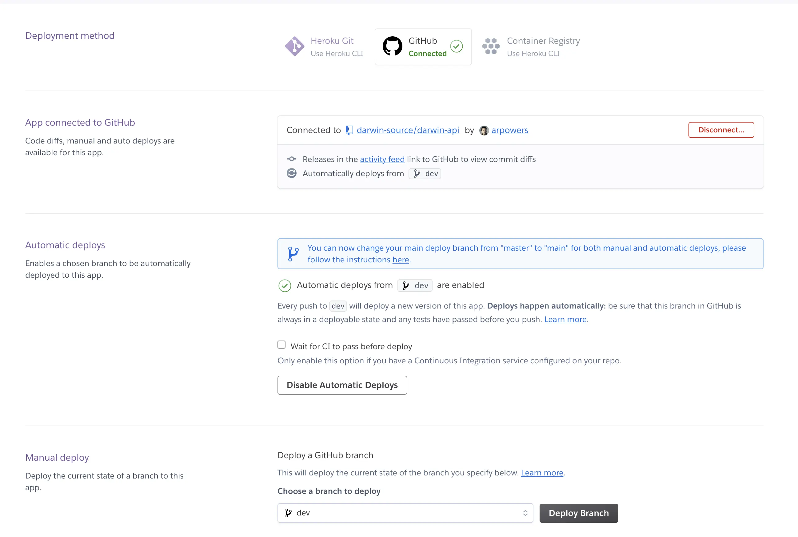

Once your application is ready to go to production, you'll need to set up your endpoint server.

If you're running your application in JamStack mode, then often the endpoint server will be hosted on an entirely different service as your primary app.

Running your server requires NO build step and only needs the following:

- Deploy your application code to the host service (e.g. Heroku)
- Run the `factor server` command

## Example: Heroku

Heroku is a cheap and simple way to run your endpoint server. It's what we use at [Darwin](https://www.darwin.so). Here is a quick example of how that works.

To run your endpoint server on Heroku, follow these steps:

### Add "Run" Command (Procfile)

Heroku uses a `Procfile` to determine which command is needed to run your app.

Add this file to the root of your repo and inside it add this code:

```bash
web: npx factor server
```

### Add Deploy

Create an application on Heroku and name it whatever you'd like. Once that's done, visit the "deploy" tab and select `Github` for deployment method.

Now, select the Factor application repo where you've added your `Procfile`. Set it up to deploy the code however you'd like.



### Get FACTOR_SERVER_URL

Once you've deployed your code and ran the `server` command, your Factor server should be running. All that is needed now is the URL. You'll need to add the URL to your application as an env. variable called `FACTOR_SERVER_URL`.

You can find the URL for your Heroku endpoint under "settings" > "domains". Follow the instructions there if you'd like to customize it.
