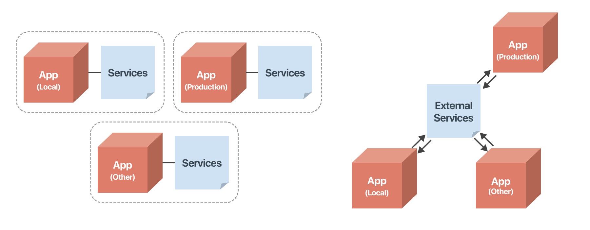

If you want to build a solid app then you better do your homework. Here we'll walk through some of the problems we've encountered and explain the design choices that make Factor ideal to solve them.

## Key Technologies

Factor is designed to provide structure and help with best practices. It is built with cutting edge JS technologies:

- TypeScript
- Vite and ESBuild
- Node and Express
- TailwindCSS (optional)
- Vue3

> **Note:** Factor can be used with any frontend framework such as React, Svelte, etc.. However at this time we've decided to focus on working wih Vue3 applications.

## Easily Work In Many Environments

**Problem**
The most common CMS structure&mdash;used by tools like WordPress, Drupal, Ghost, etc.&mdash; is to combine everything together into one giant "monolith." That means the code for your your database, image storage, email, app all live together in the same install.

While this may have certain advantages, there is one massive problem that arises: _you can't work easily across environments_. In other words, your development work and production work are always going to be different. This leads to challenges because things that work locally, might break when you push to production.

Also, you may want to share a database or images across multiple websites or apps. This isn't possible with the monolithic approach without working with their APIs (and adopting a bunch more code in the process.)

**Solution**
Factor follows the [12 Factor App methodology](https://12factor.net) which outlines a strategy for achieving maximum portability in your applications. It does this by having your connect key services&mdash;like your image storage and database&mdash; which allows you to easily share them across multiple apps.

## Scale Your Apps Cheaply

**Problem**
The ability of your application to "scale" is important, not necessarily because you'll be pushing millions of page views, but also because this directly correlates to the cost of running your app.

Many older frameworks are hard to scale (e.g. WordPress, Rails).

This is because they are server-rendered and servers have to work every time a user loads a page. This can be solved somewhat by caching, but becomes challenging when you want to deliver user-specific content.

**Solution**
The modern JAMStack paradigm recommends you build your application templates ahead of time and simply make calls to API endpoints when interactivity is needed. This makes Factor, and other JAMStack apps, super easy to host and scale.

## Extend Your Apps

**Problem**
JavaScript frameworks are nice for easily getting started with a basic structure. However, most frameworks suffer from a common issue: they are difficult to extend. In an effort to remain un-opinionated, they leave the structure of your dashboard, database, and data to the user.

**Solution**
Factor provides a simple yet powerful extension interface which allows you to easily use plugins and even themes by including them in your files.

## Avoid Proprietary APIs and Services

**Problem**
With JAMStack apps, it's become to easy to delegate critical functionality to services run by third-parties.

APIs can be problematic. It is hard to work across many APIs. Things can quickly become a web of requests and integrations that are nearly impossible to work with effectively.

**Solution**
Factor comes with a standard endpoint framework that makes it easy to create your own Node powered endpoints to do whatever you need.

## Keep Your Apps Simple

**Problem**
Most full-stack applications are a compilation of dozens of technologies which sometimes don't work well together.

**Solution**
Factor uses JavaScript related technologies for everything; adding TypeScript for help with stability on the backend.

## Software Philosophy

Here are some key "rules" we follow in Factor:

- **Simple as possible, not simpler.** All features and code sets that are added to Factor core have a clear reason for being there. Anything else belongs in an extension.
- **80% Rule of Core vs Extension.** Most features belong in an extension; this allows us to keep Factor core light while allowing users to "choose their own adventure" regarding which features they'd like to have (via plugins and themes). The rule is that any core feature must be needed or useful to at least 80% of the user base.
- **Unix philosophy.** Factor generally follows the rules and guidelines outlined in books about the [Unix Philosophy](https://en.wikipedia.org/wiki/Unix_philosophy). Essentially, this means we:
  - Favor portability over efficiency.
  - Use small modules with one key purpose.
  - Build new modules rather than add new features to old ones.
- **The 12 Factor App** The [12 Factor App](https://12factor.net/) guideline discusses how to build apps that are scalable and portable; also, easy to develop. Factor leverages this philosophy.
- **JavaScript and TypeScript Only** In the last years, the one language that has made the most progress is clearly JavaScript and it's type-safe buddy TypeScript. For that reason, Factor is focused on JS and JS oriented libraries. That way you only need to learn one key language and complementary tools.
- **The value of open-source.** Working with proprietary technology often leads to risks and costs in the long term. We've found that open-source tech is not only free but also reduces risk and encourages standardization of your app.
