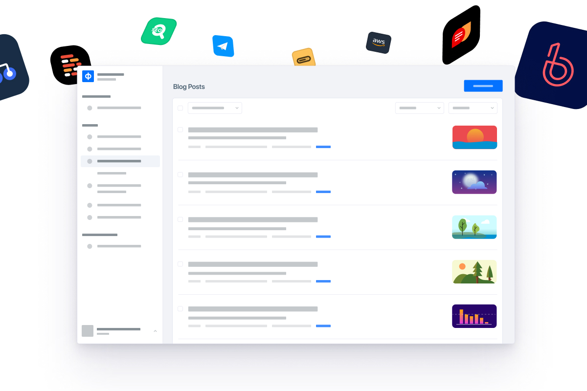

Factor is an open-source JavaScript platform designed to be minimal but create enough structure to enforce best practices for modern apps.

It is designed for people who want control and don't like limitations. It's also nice for teams who need power and flexibility but have deadlines.

Hitting the right balance of needs has led Factor to be used in production by many organizations. Once you learn the basics, you'll love how easy it is to create superior websites and apps.

Every day Factor powers some of the most powerful yet scalable apps on the internet. Its modern architecture allows for portability, performance, and optimization which allows you to do more.

## The Problem Factor Solves

Building quality JavaScript apps is hard.

Developers are forced to adopt too much code and things become complicated quickly. Months can be wasted on boilerplate functionality that doesn't add distinct value to your app.

The solution is using a core framework that helps you with best practices and structure; and then gives you the ability to easily work with your own code to reach your mission-specific goals.

Factor is here to help you with this.

## How Factor Is Different

The first question people usually ask is, how is Factor different from everything else out there?

A few key characteristics of Factor:

- **ES Modules** - Factor only uses the most modern standards in JavaScript. No webpack or CommonJS.
- **JavaScript Tools** - All tools in Factor are designed to be JS compatible. TypeScript, Node, Vite, etc.
- **Easy Extension** - Work with a special architecture that allows you to add new functionality in seconds.
- **Server & App in One Environment** - It provides a structure that connects your UI to custom server-side endpoints.
- **Modern Portability and Scalability** - It uses modern technology to scale and work within different environments. This is a traditional pain point of "classic" frameworks like Rails and WordPress.

Here is a comparison table to help you quickly see how things compare:

<table class="features-comparison min-w-full ">
  <thead>
    <tr>
      <th scope="col"></th>
      <th scope="col">Factor <small class="text-color-500 text-xs font-medium">(JavaScript CMS)</small></th>
      <th scope="col">PHP CMS <small class="text-color-500 text-xs font-medium">(eg. WordPress)</small></th>
      <th scope="col">Webpack Frameworks <small class="text-color-500 text-xs font-medium">(eg. Gatsby, Nuxt, Next)</small></th>
    </tr>
  </thead>
  <tbody>
    <tr>
      <td class="font-semibold p-2"><i class="mr-2">1️⃣</i> Single Language</td>
      <td class="text-center">✅</td>
      <td class="text-center">❌</td>
      <td class="text-center">✅</td>
    </tr>
    <tr>
      <td class="font-semibold p-2"><i class="mr-2">🚀</i> Modern Stack</td>
      <td class="text-center">✅</td>
      <td class="text-center">❌</td>
      <td class="text-center">❌</td>
    </tr>
    <tr>
      <td class="font-semibold p-2"><i class="mr-2">🔌</i> Easy to Extend</td>
      <td class="text-center">✅</td>
      <td class="text-center">✅</td>
      <td class="text-center">❌</td>
    </tr>
    <tr>
      <td class="font-semibold p-2"><i class="mr-2">🏎</i> Rapid Development</td>
      <td class="text-center">✅</td>
      <td class="text-center">❌</td>
      <td class="text-center">❌</td>
    </tr>
    <tr>
      <td class="font-semibold p-2"><i class="mr-2">📈</i> Easily Scalable</td>
      <td class="text-center">✅</td>
      <td class="text-center">❌</td>
      <td class="text-center">✅</td>
    </tr>

  </tbody>
</table>

### The Backstory

Factor was created as an internal framework for building our own apps at [Darwin](https://www.darwin.so).

After wasting many months reading technical documentation, debugging, reinventing the wheel, and discovering undisclosed limitations of various services; we decided we needed to formalize our software approach and build something simple and standard.

With that, we started building Factor.

### Try It Out

Now that you know a little about Factor, and what it can do for you, you probably want to learn about [installation and setup](./quickstart) or read about it's [core concepts and architecture](./core-concepts).
